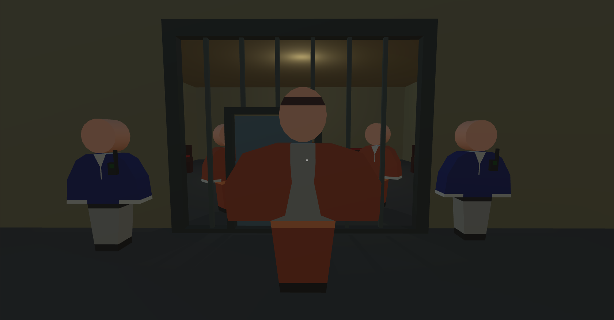

# Scenes 
- Cells
- Canteen
- Main guard office
- Backyard
- Execution zone

### Cells
Represents big room with a lot of small cells.

Player lives in the his own cell, where also lives mouse. On the table player has different food.

Scene has two special cells: big cell for cool prisoner and unused cell, where player could find cigarettes.

 

### Canteen
Representing room, where all prisoners could eat.

### Main guard office
Representing zone, where works main guard of the prison.

### Backyard
Representing zone, where prisoners could relax and walk around. Also in this place player could find a merchant.

### Execution zone
Concept of the execution zone, which will be implemented later. 

## Resume
 - 4 scenes + concept of Execution zone scene
 - Prisoners and guards models + special models as cool prisoner, main guard, merchant and mouse
 - Accommodation: cells with 2 unic cells: big cell for cool prisoner and unused cell with broken grid
 - A lot of objects in the scenes and unic objects, like cigarettes, food and others.