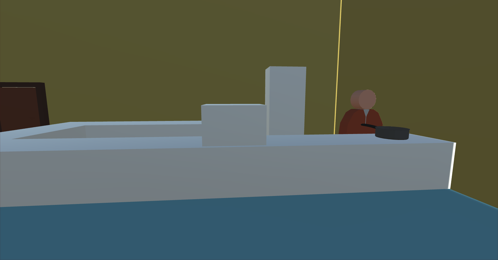
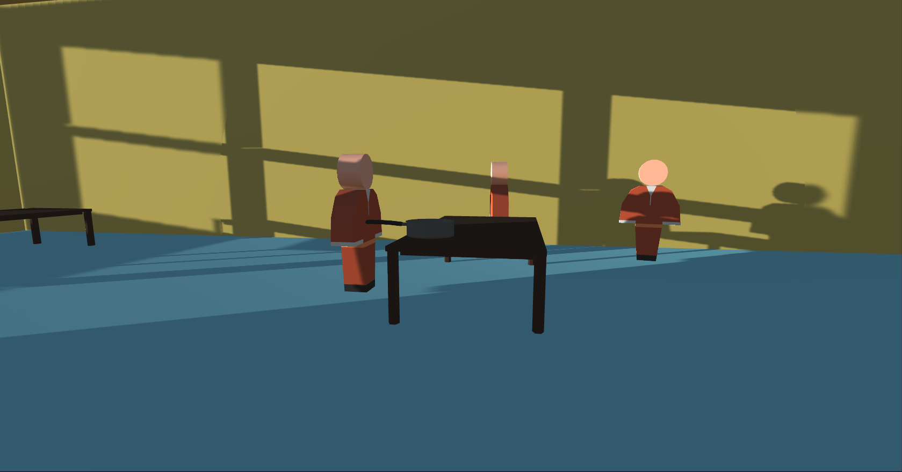
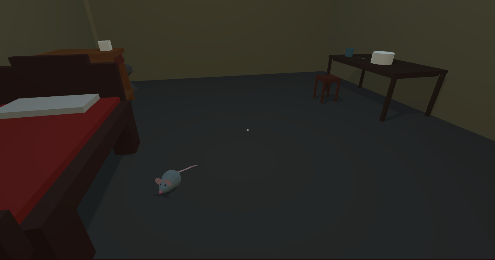

## Animation
We did animation for prisoners. For now they have 2 animation states: Walk and Idle. Also we did animation for mouse, which has same animation states: Walk and Idle.

## Cyclic activities and behaviors

#### Cook
Cook has 3 states:
1. Cooking. The cook takes new pan and goese to the stove, where he cooks.
2. Giving food. The cook goes to the place, where leave pan with food.
3. Relaxing. Returns to the relax zone and waits here until someone takes pan with food.

#### Prisoner
Prisoner in the Canteen scene has 5 states:
1. Walking. The prisoner just walks around.
2. Waiting. He stands on one place.
3. Taking food. If cook prepared some food, he runs to the food, takes it and find free spot for eating
4. Eating. He eats
5. Giving food. He returns pan to the kitchen. From this moment he isn't hungry and won't eat again

#### Mouse
Mouse has 3 states:
1. Walking. Mouse walks around player's room. 
2. Eating. If on the floor lies food, then mouse run to this food and eats it
3. Relaxing. Returns under the player's bed and sleeps here.

If player will be very close to mouse, then mouse will run away from the player under the bed.

## Resume
- We add more models, improve scenes
- Animate prisoners and mouse. Prisoners have same model structure, so they animation will work for other characters too.
- Create cyclic activities and behaviors for Cook and Prisoners from Canteen scene.
- Create cyclic activities and behaviors for Mouse from Cells scene.
- We don't create production part and unic activities